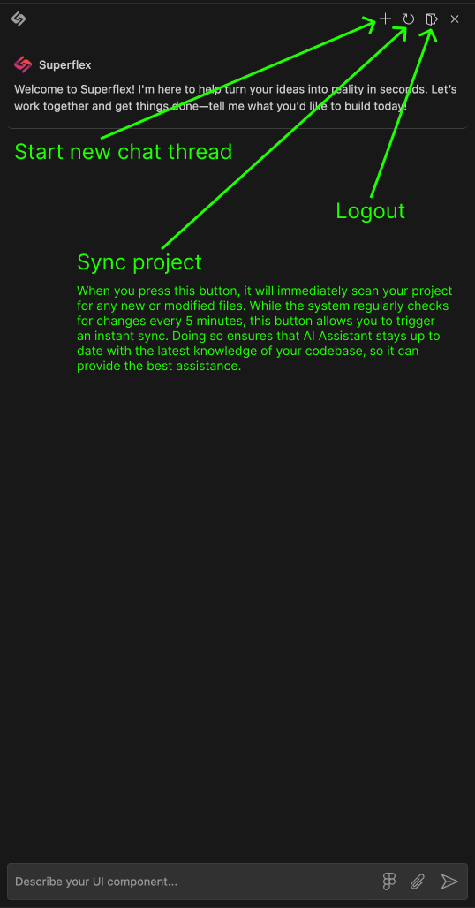

[twitter-shield]: https://img.shields.io/twitter/follow/_riphal_?style=social
[twitter-url]: https://x.com/_riphal_
[github-shield]: https://img.shields.io/github/stars/aquila-lab/superflex-vscode?style=social
[github-url]: https://github.com/aquila-lab/superflex-vscode
[vscode-shield]: https://img.shields.io/visual-studio-marketplace/r/aquilalabs.superflex?logo=visual-studio-code&style=social
[vscode-url]: https://marketplace.visualstudio.com/items?itemName=aquilalabs.superflex
[downloads-shield]: https://img.shields.io/visual-studio-marketplace/d/aquilalabs.superflex?style=social
[downloads-url]: https://marketplace.visualstudio.com/items?itemName=aquilalabs.superflex
[youtube-shield]: https://img.shields.io/badge/Demo-Video-red?style=flat&logo=youtube
[youtube-url]: https://youtu.be/YFcTjJDFsbg?si=WQVteFa4UK9_bynz

[![Github Repo][github-shield]][github-url] [![VSCode Plugin][vscode-shield]][vscode-url] [![Downloads][downloads-shield]][downloads-url] [![Twitter Follow][twitter-shield]][twitter-url] [![Demo Video][youtube-shield]][youtube-url]

# Superflex: The Ultimate AI-Powered Frontend Development Assistant

Superflex is an AI-powered front-end assistant that you control, transforming ideas into production-ready code effortlessly. It generates features from Figma designs, images, or text prompts while adhering to your code style, design standards, and existing UI components. Superflex accelerates development, enhances code quality, and boosts developer productivity. Build better frontends faster with Superflex, the ultimate AI code companion for Visual Studio Code.

## Get Started in Seconds

Get started with Superflex in seconds:

1. Install Superflex from the [Visual Studio Code Marketplace][vscode-url].
2. Open your project in VSCode.
3. Access Superflex through the command palette or sidebar.
4. For better accessibility to Superflex and file system at the same time, move Superflex to the secondary sidebar by just drag and dropping it there like in the image below. \
   
5. Start coding at superhuman speed!

## Product Overview

Experience the power of Superflex in action:

## Key Features

- **AI-Powered Chat Interface**: Seamlessly integrate Superflex into your workflow with our intuitive in-VSCode chat.

- **Code Consistency Guarantee**: Superflex doesn't just write code - it learns and adheres to your project's standards, ensuring a cohesive codebase.

- **Figma-to-Code Integration**: Directly import your Figma designs and let Superflex translate them into production-ready code. \
  

- **Image-to-Code Conversion**: Upload any UI component image/screenshot and watch as Superflex generates pixel-perfect code instantly.

- **Sketch-to-Code**: Upload hand-drawn sketches and see them transformed into functional code, following your design system and coding style. \
  

- **Intelligent Brainstorming**: Leverage our AI to generate innovative ideas and refactor your components and pages for optimal performance and code quality.

## Chat Interface Overview

Superflex provides an intuitive chat interface to streamline your development process:

- **Start new chat thread**: Begin a fresh conversation with Superflex.
- **Sync project**: Instantly update Superflex with your latest code changes.
- **Logout**: Sign out of your Superflex session.

  

## Dedicated Support

We're committed to your success:

- Report issues on our [GitHub repository][github-url]
- Get personalized help at [boris@superflex.ai](mailto:boris@superflex.ai)

## License

Superflex is proudly released under the [MIT License](LICENSE).

---

Experience the future of frontend development with Superflex - Where AI and human creativity combine to produce extraordinary results.
