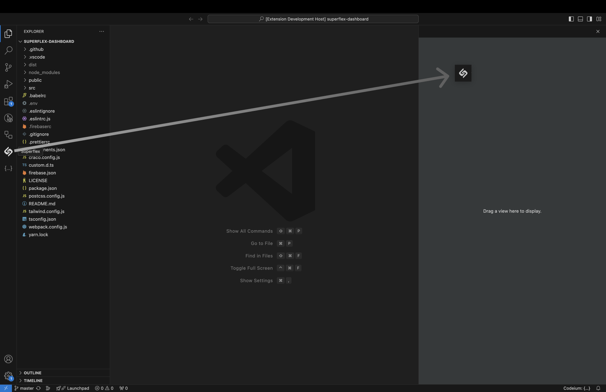

[twitter-shield]: https://img.shields.io/twitter/follow/superflex_ai?style=social
[twitter-url]: https://x.com/superflex_ai
[github-shield]: https://img.shields.io/github/stars/aquila-lab/superflex-vscode?style=social
[github-url]: https://github.com/aquila-lab/superflex-vscode
[vscode-shield]: https://img.shields.io/visual-studio-marketplace/r/aquilalabs.superflex?logo=visual-studio-code&style=social
[vscode-url]: https://marketplace.visualstudio.com/items?itemName=aquilalabs.superflex
[downloads-shield]: https://img.shields.io/visual-studio-marketplace/d/aquilalabs.superflex?style=social
[downloads-url]: https://marketplace.visualstudio.com/items?itemName=aquilalabs.superflex
[youtube-shield]: https://img.shields.io/badge/Demo-Video-red?style=flat&logo=youtube
[youtube-url]: https://youtu.be/pP25PXwV_60?si=Piz20NC4R0hWXSSS

[![Github Repo][github-shield]][github-url] [![VSCode Plugin][vscode-shield]][vscode-url] [![Downloads][downloads-shield]][downloads-url] [![Twitter Follow][twitter-shield]][twitter-url] [![Demo Video][youtube-shield]][youtube-url]

# Superflex: AI Frontend Assistant

## Turn Figma Designs, Images & Prompts into Production-Ready Code – in Seconds

Superflex is your ultimate frontend assistant that makes frontend development seamless. From transforming Figma designs to coding entire pages in seconds, Superflex ensures your design standards and coding style are always maintained.

## 🌟 **New in Superflex v1.0.0**

- **New Chat UI**: Clean, intuitive chat interface that follows your VSCode theme colors.
- **Chat Conversation History**: Keep track of your chat history and continue conversations from where you left off.
- **Edit previous messages**: Edit previous messages in the chat and re-generate the response.
- **Stop generation**: Stop the generation of a response at any time.
- **Improved Settings Page**: Manage your Superflex settings with ease.
- **Better streaming support**: Superflex now supports streaming responses, so you can see the code being generated in real-time.
- **File Search**: Search for files in your project and add them to your chat.
- **Hints & Shortcuts**: Get hints and shortcuts for the chat commands.

## 🚀 Get Started with Superflex

### In Visual Studio Code

1. Install Superflex from the [Visual Studio Code Marketplace][vscode-url].
2. Open your project in VSCode.
3. Access Superflex from the sidebar or press **[⌘;]** to open Superflex.
4. Move Superflex to the secondary sidebar for better multitasking.  
   
5. Start coding at superhuman speed!

### In Cursor

1. Open Extensions **[⇧⌘X]** in Cursor and type _"Superflex"_, then click on install.
2. Open your project and open Superflex through the sidebar or press **[⌘;]** to open Superflex.
3. Use the intuitive chat interface to build, refactor, and enhance your UI components.
4. Experience AI-driven productivity for seamless coding.

## 🚀 **Core Features**

### 🖌️ **Figma-to-Code**

Upload Figma designs, and Superflex delivers responsive, production-ready code tailored to your design system.  

### 🎨 **Image-to-Code**

Convert any UI screenshot into functional components, adhering to your design standards.  

### ✍️ **Sketch-to-Code**

Even hand-drawn sketches can be turned into polished code, fast and efficiently.  

Here’s an updated section explaining the new functionality for adding any selection or file to chat seamlessly:

### 🛠 Add Any Selection or File to Chat

Superflex now lets you add any selected code or entire files into the chat context seamlessly:

1. **Select a Code Snippet**: Highlight any portion of code in your editor then click **[⌘M]** to add to chat.
2. **Select Files from Project**: Click on **+** inside chat to select files from your project to add to chat.

### 💬 **Codebase Chat**

Ask questions, generate features, or get instant help navigating your codebase.

### ♻️ **Smart Refactoring**

Refactor your components or pages for clean, maintainable code without breaking functionality.

## ⚡ **Why Superflex?**

- **Save Hours**: Automate repetitive coding tasks.
- **Code Consistency**: Adheres to your team’s design system and coding conventions.
- **Beginner-Friendly**: Perfect for designers or developers new to front-end work.

## 📖 **How to Get Started**

1. Install Superflex from the [Visual Studio Marketplace][vscode-url].
2. Open your project and activate Superflex from the command palette.
3. Drag the Superflex panel to the secondary sidebar for seamless multitasking.
4. Start building at **superhuman speed**!

## 🔗 **Stay Connected**

- 💬 Questions? Contact us at [boris@superflex.ai](mailto:boris@superflex.ai).
- 🔧 Report issues on [GitHub](https://github.com/aquila-lab/superflex-vscode/issues).

Discover more at [superflex.ai](https://superflex.ai)
